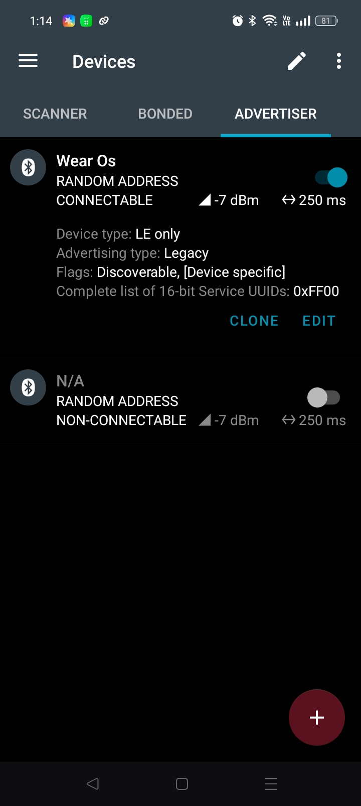
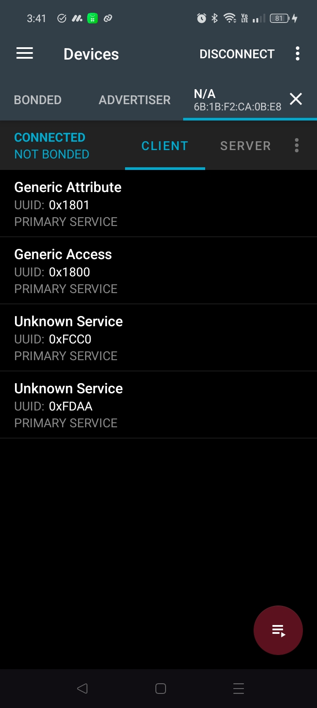
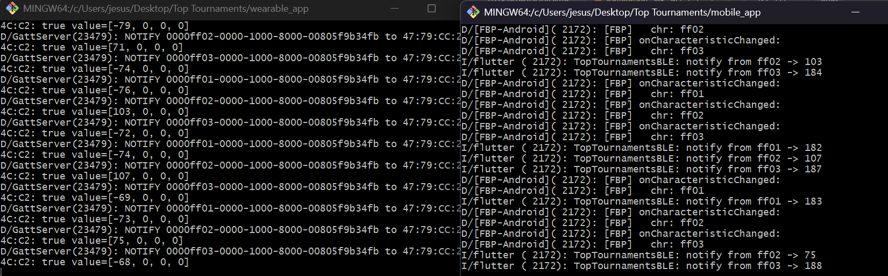
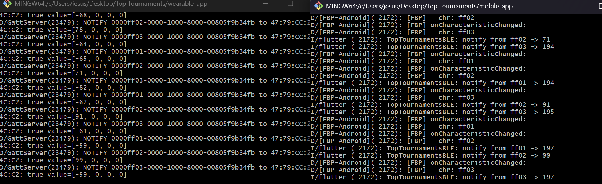
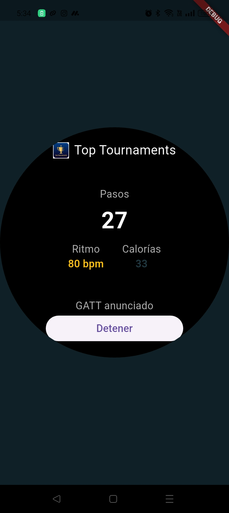
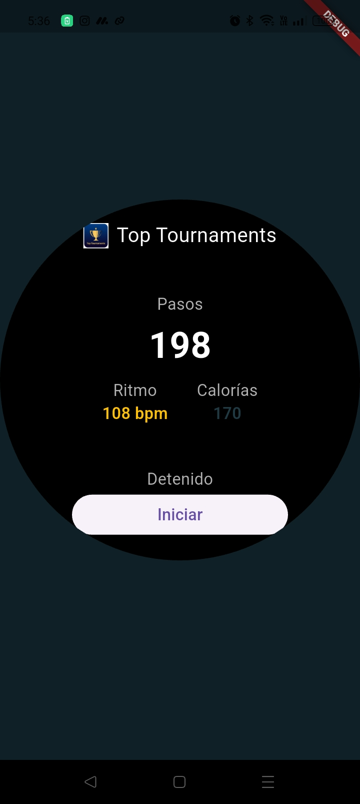
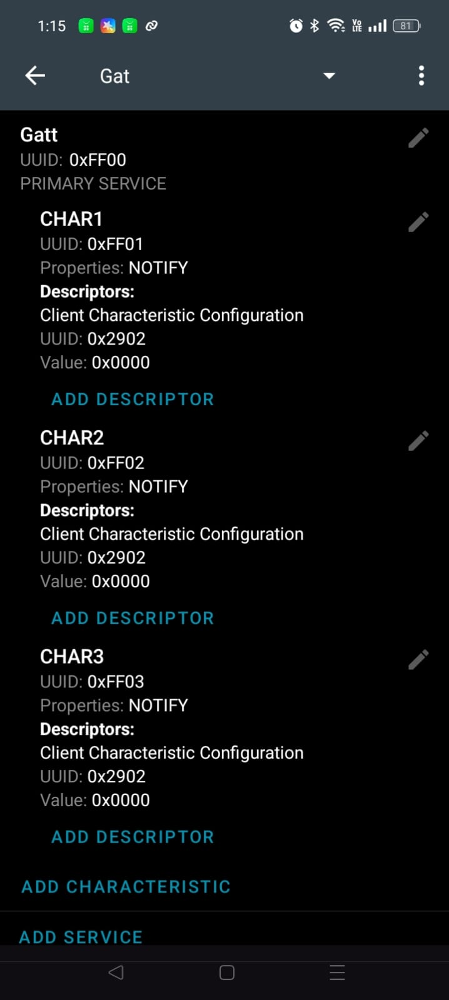

# Documento formal de evaluación
## Evaluación 2 Extraordinaria · Mayo-Agosto 2026

> Completar los campos marcados como `[PENDIENTE]` con los datos personales, URL pública, capturas y tiempos medidos. Este documento conserva la numeración exigida en el Anexo A.

## 1. Datos de identificación
- Nombre: Jesús Zabdiel Hernández Martínez
- Matrícula: 2023371177
- Grupo: IDGS16
- Fecha: 26/08/2026
- Repositorio: (https://github.com/Zabdiel732/top-tournaments.git)
- Rama evaluada:  `evaluacion-2-extraordinaria`

## 2. Descripción general de la solución
El ecosistema está compuesto por `wearable_app`, `mobile_app` y `tv_pwa`.

```text
Wear GATT Server
  -> BLE GATT / NOTIFY (Int32 little-endian, 4 bytes)
  -> Teléfono Android GATT Client
  -> Firestore ecosystem/current
  -> PWA Smart TV mediante onSnapshot()
```

El Wear publica tres características notificables: pasos, ritmo y calorías. El teléfono escanea por `SERVICE_UUID`, conecta, descubre servicios, habilita CCCD, decodifica los bytes y escribe el estado. La PWA escucha el documento en tiempo real y actualiza la interfaz sin recargar.

## 3. E1 - Wear OS y BLE GATT/NOTIFY
- Aplicación: `wearable_app`.
- Métricas: pasos acumulados, ritmo instantáneo y calorías acumuladas.
- Periodicidad: aproximadamente 1 segundo.
- Control: botón `Iniciar` / `Detener`.
- Servicio: `0000ff00-0000-1000-8000-00805f9b34fb`.
- Características: `ff01` pasos, `ff02` ritmo, `ff03` calorías.
- CCCD: `00002902-0000-1000-8000-00805f9b34fb`.
- Implementación nativa: `wearable_app/android/app/src/main/kotlin/com/toptournaments/wearable_app/GattServer.kt`.
- Evidencia: `E1-EV01` [PENDIENTE: captura con GATT service registered, Advertising started y métricas] GATT service: , Advertising started:  , Metricas: .

## 4. E2 - Teléfono Android y recepción BLE
- Implementación: `mobile_app/lib/main.dart`.
- Permisos: Bluetooth Scan, Bluetooth Connect y ubicación cuando el sistema lo requiere.
- El escaneo usa `withServices` con el UUID del servicio.
- Se evita iniciar conexiones duplicadas con `_isConnecting` y `connectedDevice`.
- Se descubren servicios y se habilitan las tres notificaciones mediante `setNotifyValue(true)`, que escribe el CCCD.
- Protocolo: entero con signo de 32 bits, little-endian, 4 bytes. Ejemplo `01 00 00 00` = 1.
- Desconexión: se muestra `Wearable desconectado` y se libera la conexión para permitir reintento.
- Evidencias: `E2-EV01` conexión;
 `E2-EV02` suscripciones;
 `E2-EV03` recepción de las tres métricas [PENDIENTE: capturas/logs].

## 5. E3 - PWA Smart TV
- Implementación: `tv_pwa/index.html`, `tv_pwa/app.js`, `tv_pwa/styles.css`.
- Manifest: fullscreen y landscape.
- Resolución objetivo: 1920x1080; safe zone: 96 px horizontal y 54 px vertical.
- Grid: 2x2, sin scroll, valores principales de al menos 80 px.
- Service Worker: `tv_pwa/sw.js`, caché de recursos estáticos y fallback offline.
- Navegación: flechas, `Enter` y `OK`; los límites conservan el foco.
- Fallback: se conserva el último estado en `localStorage` si Firestore no está disponible.
- Multimedia: [PENDIENTE: documentar recurso multimedia y fallback si se incorpora].
- Evidencias: `E3-EV01` PWA; `E3-EV02` Service Worker; `E3-EV03` D-pad; `E3-EV04` offline.

## 6. E4 - Firestore y sincronización
- Documento: `ecosystem/current`.
- Campos: `ritmo`, `pasos`, `calorias`, `timestamp`.
- El teléfono escribe con Firestore usando `set` y `merge`.
- La PWA escucha con `onSnapshot()`.
- Resultado esperado: actualización visible sin recargar y menor a 2 segundos.

| Corrida | Acción | Tiempo | Cumple | Evidencia |
|---|---|---:|---|---|
| 1 | Cambio de métricas desde Wear | 1 s | [Sí] |  |
| 2 | Cambio de métricas desde Wear | 1 s | [Sí] |  |
| 3 | Cambio de métricas desde Wear | 1 s | [Sí] |  |

## 7. E5 - Pruebas funcionales y manejo de fallos

| ID | Prueba | Procedimiento | Resultado esperado | Resultado obtenido | Cumple |
|---|---|---|---|---|---|
| E5-EV01 | Wear | Iniciar, observar, detener | Métricas cambian y se detienen | []  | [ si ] |
| E5-EV02 | BLE NOTIFY | Conectar y suscribirse | Llegan valores sin polling | [PENDIENTE] | [ ] |
| E5-EV03 | D-pad | Flechas y Enter/OK | Foco y límites correctos | [PENDIENTE] | [ ] |
| E5-EV04 | Offline | DevTools Offline y recarga | Interfaz carga desde caché | [PENDIENTE] | [ ] |
| E5-EV05 | Desconexión | Interrumpir enlace BLE | No hay crash; estado visible | [PENDIENTE] | [ ] |
| E5-EV06 | Firestore | Tres actualizaciones | TV actualiza sin recarga; <2 s | [PENDIENTE] | [ ] |
| E5-EV07 | Multimedia | Provocar fallo | Fallback visual | [PENDIENTE] | [ ] |
| E5-EV08 | Red/API | Simular error | Estado offline coherente | [PENDIENTE] | [ ] |

## 8. E6 - Integración y configuración reproducible
- Flutter/Dart: `flutter --version` [PENDIENTE: registrar salida].
- VS Code y extensiones: Version mas reciente de VS CODE
- Teléfono cliente: [Redmi note 13 pro, android 15 y RAM 8+4].
- Wear o periférico: [Oppo A40, Android 14 y RAM 4+4].
- Chrome DevTools: viewport 1920x1080.
- Firebase: proyecto `top-tournaments`; Firestore habilitado; reglas: rules_version = '2';

service cloud.firestore {
  match /databases/{database}/documents {
    match /ecosystem/current {
      allow read, write: if true;
    }
  }
}
 y región: Mexico.
- BLE: el Wear actúa como GATT Server/Peripheral y el teléfono como GATT Client/Central.
- Ejecución: iniciar Wear, iniciar móvil, servir `tv_pwa` con `npx serve .`, abrir la URL local.
- Limitación: el advertising en emuladores Android puede ser inestable; se utilizó [dispositivo físico/emulador PENDIENTE].

## 9. Inventario de evidencias
| ID | Criterio | Descripción | Referencia |
|---|---|---|---|
| E1-EV01 | E1 | Registro GATT y advertising |   |
| E2-EV01 | E2 | Scan, conexión y descubrimiento | [PENDIENTE] |
| E2-EV02 | E2 | CCCD y tres suscripciones | [PENDIENTE] |
| E2-EV03 | E2 | Tres NOTIFY decodificados | [PENDIENTE] |
| E3-EV01 | E3 | PWA en 1920x1080 | [PENDIENTE] |
| E3-EV02 | E3 | Service Worker activo | [PENDIENTE] |
| E3-EV03 | E3 | D-pad y foco | [PENDIENTE] |
| E3-EV04 | E3 | Funcionamiento offline | [PENDIENTE] |
| E4-EV01 | E4 | Primera sincronización | [PENDIENTE] |
| E4-EV02 | E4 | Segunda sincronización | [PENDIENTE] |
| E4-EV03 | E4 | Tercera sincronización | [PENDIENTE] |

## 10. Lighthouse
Ejecutar Lighthouse sobre la PWA y conservar reportes antes/después.

| Métrica | Antes | Después |
|---|---:|---:|
| Performance | [PENDIENTE] | [PENDIENTE] |
| Accessibility | [PENDIENTE] | [PENDIENTE] |
| Best Practices | [PENDIENTE] | [PENDIENTE] |
| SEO | [PENDIENTE] | [PENDIENTE] |

Hallazgo corregido: [PENDIENTE].

## 11. Problemas encontrados y soluciones
- API de Firestore deshabilitada: se habilitó la API y se creó la base de datos.
- Reglas Firestore restrictivas: se configuraron reglas de desarrollo y deben endurecerse antes de producción.
- Advertising GATT asíncrono: se inició después de `onServiceAdded`.
- Paquetes BLE demasiado grandes: el nombre se movió al scan response.
- Comparación de UUID corto/completo: se normalizó mediante `Guid`.
- Pasos no acumulados: el servidor mantiene contadores nativos.
- [PENDIENTE: añadir resultado final de desconexión y Lighthouse].

## 12. Guion de demostración
1. Mostrar rama y repositorio.
2. Iniciar Wear y mostrar tres métricas.
3. Pulsar `Iniciar` y mostrar GATT registrado y advertising.
4. Iniciar móvil, escanear por servicio y conectar.
5. Mostrar `ff01`, `ff02`, `ff03`, CCCD y valores recibidos.
6. Mostrar documento `ecosystem/current` en Firestore.
7. Abrir PWA y demostrar actualización sin recarga.
8. Demostrar flechas, `Enter`/`OK`, límites y foco.
9. Activar Offline y demostrar la interfaz cacheada.
10. Interrumpir BLE y mostrar estado recuperable.
11. Presentar Lighthouse y limitaciones.

## 13. Conclusiones
El flujo Wear → BLE GATT/NOTIFY → teléfono → Firestore → PWA está implementado y fue probado en dispositivos [PENDIENTE]. La evidencia disponible demuestra E1, E2 y la base de E3/E4. Para cerrar la entrega se deben adjuntar capturas, completar las tres corridas de sincronización, ejecutar Lighthouse y registrar configuración, privacidad y limitaciones reales.
